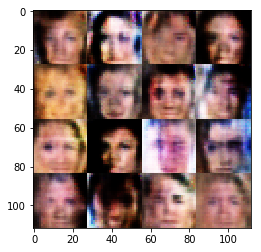
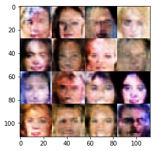

# Face Generation
In this project, you'll use generative adversarial networks to generate new images of faces.
### Get the Data
You'll be using two datasets in this project:
- MNIST
- CelebA

Since the celebA dataset is complex and you're doing GANs in a project for the first time, we want you to test your neural network on MNIST before CelebA.  Running the GANs on MNIST will allow you to see how well your model trains sooner.

If you're using [FloydHub](https://www.floydhub.com/), set `data_dir` to "/input" and use the [FloydHub data ID](http://docs.floydhub.com/home/using_datasets/) "R5KrjnANiKVhLWAkpXhNBe".


```python
data_dir = './data'

# FloydHub - Use with data ID "R5KrjnANiKVhLWAkpXhNBe"
#data_dir = '/input'


"""
DON'T MODIFY ANYTHING IN THIS CELL
"""
import helper

helper.download_extract('mnist', data_dir)
helper.download_extract('celeba', data_dir)
```

    Found mnist Data
    Found celeba Data
    

## Explore the Data
### MNIST
As you're aware, the [MNIST](http://yann.lecun.com/exdb/mnist/) dataset contains images of handwritten digits. You can view the first number of examples by changing `show_n_images`. 


```python
show_n_images = 25

"""
DON'T MODIFY ANYTHING IN THIS CELL
"""
%matplotlib inline
import os
from glob import glob
from matplotlib import pyplot

mnist_images = helper.get_batch(glob(os.path.join(data_dir, 'mnist/*.jpg'))[:show_n_images], 28, 28, 'L')
pyplot.imshow(helper.images_square_grid(mnist_images, 'L'), cmap='gray')
```


    <matplotlib.image.AxesImage at 0x7fc61772d5c0>


### CelebA
The [CelebFaces Attributes Dataset (CelebA)](http://mmlab.ie.cuhk.edu.hk/projects/CelebA.html) dataset contains over 200,000 celebrity images with annotations.  Since you're going to be generating faces, you won't need the annotations.  You can view the first number of examples by changing `show_n_images`.


```python
show_n_images = 25

"""
DON'T MODIFY ANYTHING IN THIS CELL
"""
mnist_images = helper.get_batch(glob(os.path.join(data_dir, 'img_align_celeba/*.jpg'))[:show_n_images], 28, 28, 'RGB')
pyplot.imshow(helper.images_square_grid(mnist_images, 'RGB'))
```


    <matplotlib.image.AxesImage at 0x7fc6176da6a0>


## Preprocess the Data
Since the project's main focus is on building the GANs, we'll preprocess the data for you.  The values of the MNIST and CelebA dataset will be in the range of -0.5 to 0.5 of 28x28 dimensional images.  The CelebA images will be cropped to remove parts of the image that don't include a face, then resized down to 28x28.

The MNIST images are black and white images with a single [color channel](https://en.wikipedia.org/wiki/Channel_(digital_image%29) while the CelebA images have [3 color channels (RGB color channel)](https://en.wikipedia.org/wiki/Channel_(digital_image%29#RGB_Images).
## Build the Neural Network
You'll build the components necessary to build a GANs by implementing the following functions below:
- `model_inputs`
- `discriminator`
- `generator`
- `model_loss`
- `model_opt`
- `train`

### Check the Version of TensorFlow and Access to GPU
This will check to make sure you have the correct version of TensorFlow and access to a GPU


```python
"""
DON'T MODIFY ANYTHING IN THIS CELL
"""
from distutils.version import LooseVersion
import warnings
import tensorflow as tf

# Check TensorFlow Version
assert LooseVersion(tf.__version__) >= LooseVersion('1.0'), 'Please use TensorFlow version 1.0 or newer.  You are using {}'.format(tf.__version__)
print('TensorFlow Version: {}'.format(tf.__version__))

# Check for a GPU
if not tf.test.gpu_device_name():
    warnings.warn('No GPU found. Please use a GPU to train your neural network.')
else:
    print('Default GPU Device: {}'.format(tf.test.gpu_device_name()))
```

    TensorFlow Version: 1.1.0
    Default GPU Device: /gpu:0
    

### Input
Implement the `model_inputs` function to create TF Placeholders for the Neural Network. It should create the following placeholders:
- Real input images placeholder with rank 4 using `image_width`, `image_height`, and `image_channels`.
- Z input placeholder with rank 2 using `z_dim`.
- Learning rate placeholder with rank 0.

Return the placeholders in the following the tuple (tensor of real input images, tensor of z data)


```python
import problem_unittests as tests

def model_inputs(image_width, image_height, image_channels, z_dim):
    """
    Create the model inputs
    :param image_width: The input image width
    :param image_height: The input image height
    :param image_channels: The number of image channels
    :param z_dim: The dimension of Z
    :return: Tuple of (tensor of real input images, tensor of z data, learning rate)
    """
    # TODO: Implement Function
    
    inputImages = tf.placeholder(tf.float32, [None, image_width, image_height, image_channels], name='input')
    inputZ = tf.placeholder(tf.float32, [None, z_dim], name='input_z')
    learningRate = tf.placeholder(tf.float32, name='lr')

    return inputImages, inputZ, learningRate


"""
DON'T MODIFY ANYTHING IN THIS CELL THAT IS BELOW THIS LINE
"""
tests.test_model_inputs(model_inputs)
```

    Tests Passed
    

### Discriminator
Implement `discriminator` to create a discriminator neural network that discriminates on `images`.  This function should be able to reuse the variables in the neural network.  Use [`tf.variable_scope`](https://www.tensorflow.org/api_docs/python/tf/variable_scope) with a scope name of "discriminator" to allow the variables to be reused.  The function should return a tuple of (tensor output of the discriminator, tensor logits of the discriminator).


```python
def discriminator(images, reuse=False):
    """
    Create the discriminator network
    :param images: Tensor of input image(s)
    :param reuse: Boolean if the weights should be reused
    :return: Tuple of (tensor output of the discriminator, tensor logits of the discriminator)
    """
    # TODO: Implement Function
    
    x=images
    alpha=0.2
    with tf.variable_scope('discriminator', reuse=reuse):
        # Input layer is 28x28x3 or 28x28x1
        x1 = tf.layers.conv2d(x, 64, 5, strides=2, padding='same')
        relu1 = tf.maximum(alpha * x1, x1)
        # 14x14x64
        
        x2 = tf.layers.conv2d(relu1, 128, 5, strides=2, padding='same')
        bn2 = tf.layers.batch_normalization(x2, training=True)
        relu2 = tf.maximum(alpha * bn2, bn2)
        # 7x7x128
        
        x3 = tf.layers.conv2d(relu2, 256, 5, strides=1, padding='same')
        bn3 = tf.layers.batch_normalization(x3, training=True)
        relu3 = tf.maximum(alpha * bn3, bn3)
        # 7x7x256

        # Flatten
        flat = tf.reshape(relu3, (-1, 7*7*256))
        logits = tf.layers.dense(flat, 1)
        out = tf.sigmoid(logits)
        
        return out, logits

"""
DON'T MODIFY ANYTHING IN THIS CELL THAT IS BELOW THIS LINE
"""
tests.test_discriminator(discriminator, tf)
```

    Tests Passed
    

### Generator
Implement `generator` to generate an image using `z`. This function should be able to reuse the variables in the neural network.  Use [`tf.variable_scope`](https://www.tensorflow.org/api_docs/python/tf/variable_scope) with a scope name of "generator" to allow the variables to be reused. The function should return the generated 28 x 28 x `out_channel_dim` images.


```python
def generator(z, out_channel_dim, is_train=True):
    """
    Create the generator network
    :param z: Input z
    :param out_channel_dim: The number of channels in the output image
    :param is_train: Boolean if generator is being used for training
    :return: The tensor output of the generator
    """
    # TODO: Implement Function
    
    training=is_train
    reuse=(not is_train)
    output_dim=out_channel_dim
    alpha=0.2
    with tf.variable_scope('generator', reuse=reuse):
        # First fully connected layer
        x1 = tf.layers.dense(z, 7*7*512)
        
        # Reshape it to start the convolutional stack
        x1 = tf.reshape(x1, (-1, 7, 7, 512))
        x1 = tf.layers.batch_normalization(x1, training=training)
        x1 = tf.maximum(alpha * x1, x1)
        # 7x7x512 now
        
        x2 = tf.layers.conv2d_transpose(x1, 256, 5, strides=1, padding='same')
        x2 = tf.layers.batch_normalization(x2, training=training)
        x2 = tf.maximum(alpha * x2, x2)
        # 7x7x256 now
        
        x3 = tf.layers.conv2d_transpose(x2, 128, 5, strides=2, padding='same')
        x3 = tf.layers.batch_normalization(x3, training=training)
        x3 = tf.maximum(alpha * x3, x3)
        # 14x14x128 now
        
        # Output layer
        logits = tf.layers.conv2d_transpose(x3, output_dim, 5, strides=2, padding='same')
        # 28x28x3 or 28x28x1 now
        
        out = tf.tanh(logits)
        
        return out

"""
DON'T MODIFY ANYTHING IN THIS CELL THAT IS BELOW THIS LINE
"""
tests.test_generator(generator, tf)
```

    Tests Passed
    

### Loss
Implement `model_loss` to build the GANs for training and calculate the loss.  The function should return a tuple of (discriminator loss, generator loss).  Use the following functions you implemented:
- `discriminator(images, reuse=False)`
- `generator(z, out_channel_dim, is_train=True)`


```python
def model_loss(input_real, input_z, out_channel_dim):
    """
    Get the loss for the discriminator and generator
    :param input_real: Images from the real dataset
    :param input_z: Z input
    :param out_channel_dim: The number of channels in the output image
    :return: A tuple of (discriminator loss, generator loss)
    """
    # TODO: Implement Function
    
    g_model = generator(input_z, out_channel_dim, is_train=True)
    d_model_real, d_logits_real = discriminator(input_real)
    d_model_fake, d_logits_fake = discriminator(g_model, reuse=True)

    d_loss_real = tf.reduce_mean(
        tf.nn.sigmoid_cross_entropy_with_logits(logits=d_logits_real, labels=tf.ones_like(d_model_real)))
    d_loss_fake = tf.reduce_mean(
        tf.nn.sigmoid_cross_entropy_with_logits(logits=d_logits_fake, labels=tf.zeros_like(d_model_fake)))
    g_loss = tf.reduce_mean(
        tf.nn.sigmoid_cross_entropy_with_logits(logits=d_logits_fake, labels=tf.ones_like(d_model_fake)))

    d_loss = d_loss_real + d_loss_fake

    return d_loss, g_loss


"""
DON'T MODIFY ANYTHING IN THIS CELL THAT IS BELOW THIS LINE
"""
tests.test_model_loss(model_loss)
```

    Tests Passed
    

### Optimization
Implement `model_opt` to create the optimization operations for the GANs. Use [`tf.trainable_variables`](https://www.tensorflow.org/api_docs/python/tf/trainable_variables) to get all the trainable variables.  Filter the variables with names that are in the discriminator and generator scope names.  The function should return a tuple of (discriminator training operation, generator training operation).


```python
def model_opt(d_loss, g_loss, learning_rate, beta1):
    """
    Get optimization operations
    :param d_loss: Discriminator loss Tensor
    :param g_loss: Generator loss Tensor
    :param learning_rate: Learning Rate Placeholder
    :param beta1: The exponential decay rate for the 1st moment in the optimizer
    :return: A tuple of (discriminator training operation, generator training operation)
    """
    # TODO: Implement Function
    
    # Get weights and bias to update
    t_vars = tf.trainable_variables()
    d_vars = [var for var in t_vars if var.name.startswith('discriminator')]
    g_vars = [var for var in t_vars if var.name.startswith('generator')]

    # Optimize
    with tf.control_dependencies(tf.get_collection(tf.GraphKeys.UPDATE_OPS)):
        d_train_opt = tf.train.AdamOptimizer(learning_rate, beta1=beta1).minimize(d_loss, var_list=d_vars)
        g_train_opt = tf.train.AdamOptimizer(learning_rate, beta1=beta1).minimize(g_loss, var_list=g_vars)

    return d_train_opt, g_train_opt


"""
DON'T MODIFY ANYTHING IN THIS CELL THAT IS BELOW THIS LINE
"""
tests.test_model_opt(model_opt, tf)
```

    Tests Passed
    

## Neural Network Training
### Show Output
Use this function to show the current output of the generator during training. It will help you determine how well the GANs is training.


```python
"""
DON'T MODIFY ANYTHING IN THIS CELL
"""
import numpy as np

def show_generator_output(sess, n_images, input_z, out_channel_dim, image_mode):
    """
    Show example output for the generator
    :param sess: TensorFlow session
    :param n_images: Number of Images to display
    :param input_z: Input Z Tensor
    :param out_channel_dim: The number of channels in the output image
    :param image_mode: The mode to use for images ("RGB" or "L")
    """
    cmap = None if image_mode == 'RGB' else 'gray'
    z_dim = input_z.get_shape().as_list()[-1]
    example_z = np.random.uniform(-1, 1, size=[n_images, z_dim])

    samples = sess.run(
        generator(input_z, out_channel_dim, False),
        feed_dict={input_z: example_z})

    images_grid = helper.images_square_grid(samples, image_mode)
    pyplot.imshow(images_grid, cmap=cmap)
    pyplot.show()
```

### Train
Implement `train` to build and train the GANs.  Use the following functions you implemented:
- `model_inputs(image_width, image_height, image_channels, z_dim)`
- `model_loss(input_real, input_z, out_channel_dim)`
- `model_opt(d_loss, g_loss, learning_rate, beta1)`

Use the `show_generator_output` to show `generator` output while you train. Running `show_generator_output` for every batch will drastically increase training time and increase the size of the notebook.  It's recommended to print the `generator` output every 100 batches.


```python
class GAN:
    def __init__(self, real_size, z_size, learning_rate, alpha=0.2, beta1=0.5):
        #tf.reset_default_graph()
        self.input_real, self.input_z, _lr = model_inputs(real_size[0], real_size[1], real_size[2], z_size)
        self.d_loss, self.g_loss = model_loss(self.input_real, self.input_z, real_size[2])
        self.d_opt, self.g_opt = model_opt(self.d_loss, self.g_loss, learning_rate, beta1)
```


```python
def train(epoch_count, batch_size, z_dim, learning_rate, beta1, get_batches, data_shape, data_image_mode):
    """
    Train the GAN
    :param epoch_count: Number of epochs
    :param batch_size: Batch Size
    :param z_dim: Z dimension
    :param learning_rate: Learning Rate
    :param beta1: The exponential decay rate for the 1st moment in the optimizer
    :param get_batches: Function to get batches
    :param data_shape: Shape of the data
    :param data_image_mode: The image mode to use for images ("RGB" or "L")
    """
    
    # TODO: Build Model
    real_size = list(data_shape)[1:4]
    z_size = z_dim
    alpha = 0.2
    beta1 = beta1
    print_every = 10
    show_every = 100

    # Create the network
    net = GAN(real_size, z_size, learning_rate, alpha=alpha, beta1=beta1)
    
    steps = 0
    
    with tf.Session() as sess:
        sess.run(tf.global_variables_initializer())
        for epoch_i in range(epoch_count):
            for batch_images in get_batches(batch_size):
                # TODO: Train Model
                
                # batch images are scaled between -0.5 to 0.5 by preprocessing functions
                # but we need them to be from -1 to 1 as generator output is tanh, hence multiply by 2
                batch_images *= 2
                
                x=batch_images
                
                steps += 1

                # Sample random noise for G
                batch_z = np.random.uniform(-1, 1, size=(batch_size, z_size))

                # Run optimizers
                _ = sess.run(net.d_opt, feed_dict={net.input_real: x, net.input_z: batch_z})
                _ = sess.run(net.g_opt, feed_dict={net.input_real: x, net.input_z: batch_z})

                if steps % print_every == 0:
                    # At the end of each epoch, get the losses and print them out
                    train_loss_d = net.d_loss.eval({net.input_z: batch_z, net.input_real: x})
                    train_loss_g = net.g_loss.eval({net.input_z: batch_z})

                    print("Epoch {}/{}...".format(epoch_i+1, epochs),
                          "Discriminator Loss: {:.4f}...".format(train_loss_d),
                          "Generator Loss: {:.4f}".format(train_loss_g))

                if steps % show_every == 0:
                    input_z = np.random.uniform(-1, 1, size=(1, z_size))
                    show_generator_output(sess, 16, net.input_z, data_shape[3], data_image_mode)
    return
```

### MNIST
Test your GANs architecture on MNIST.  After 2 epochs, the GANs should be able to generate images that look like handwritten digits.  Make sure the loss of the generator is lower than the loss of the discriminator or close to 0.


```python
batch_size = 64
z_dim = 100
learning_rate = 0.0005
beta1 = 0.5

"""
DON'T MODIFY ANYTHING IN THIS CELL THAT IS BELOW THIS LINE
"""
epochs = 2

mnist_dataset = helper.Dataset('mnist', glob(os.path.join(data_dir, 'mnist/*.jpg')))
#print(mnist_dataset.image_mode, list(mnist_dataset.shape)[0])
```


```python
tf.reset_default_graph()
with tf.Graph().as_default():
    train(epochs, batch_size, z_dim, learning_rate, beta1, mnist_dataset.get_batches, 
          mnist_dataset.shape, mnist_dataset.image_mode)
```

    Epoch 1/2... Discriminator Loss: 3.4055... Generator Loss: 0.0490
    Epoch 1/2... Discriminator Loss: 0.2702... Generator Loss: 4.3394
    Epoch 1/2... Discriminator Loss: 1.1160... Generator Loss: 1.7779
    Epoch 1/2... Discriminator Loss: 0.2166... Generator Loss: 3.3537
    Epoch 1/2... Discriminator Loss: 1.1697... Generator Loss: 1.2236
    Epoch 1/2... Discriminator Loss: 1.7817... Generator Loss: 0.4892
    Epoch 1/2... Discriminator Loss: 0.8138... Generator Loss: 2.0814
    Epoch 1/2... Discriminator Loss: 2.7056... Generator Loss: 3.9066
    Epoch 1/2... Discriminator Loss: 2.4436... Generator Loss: 0.2364
    Epoch 1/2... Discriminator Loss: 2.5357... Generator Loss: 4.0293
    


    Epoch 1/2... Discriminator Loss: 1.2443... Generator Loss: 0.5928
    Epoch 1/2... Discriminator Loss: 1.3146... Generator Loss: 2.4818
    Epoch 1/2... Discriminator Loss: 1.6475... Generator Loss: 0.3987
    Epoch 1/2... Discriminator Loss: 0.8111... Generator Loss: 1.1043
    Epoch 1/2... Discriminator Loss: 1.2019... Generator Loss: 0.7464
    Epoch 1/2... Discriminator Loss: 1.4869... Generator Loss: 0.4659
    Epoch 1/2... Discriminator Loss: 1.4415... Generator Loss: 0.4241
    Epoch 1/2... Discriminator Loss: 1.3490... Generator Loss: 0.4833
    Epoch 1/2... Discriminator Loss: 1.2954... Generator Loss: 0.4971
    Epoch 1/2... Discriminator Loss: 1.1792... Generator Loss: 0.6947
    


    Epoch 1/2... Discriminator Loss: 1.0613... Generator Loss: 0.8758
    Epoch 1/2... Discriminator Loss: 1.1233... Generator Loss: 0.9416
    Epoch 1/2... Discriminator Loss: 1.4704... Generator Loss: 2.3591
    Epoch 1/2... Discriminator Loss: 1.0896... Generator Loss: 1.2683
    Epoch 1/2... Discriminator Loss: 1.0182... Generator Loss: 1.1247
    Epoch 1/2... Discriminator Loss: 1.3046... Generator Loss: 0.6880
    Epoch 1/2... Discriminator Loss: 1.3727... Generator Loss: 0.4330
    Epoch 1/2... Discriminator Loss: 1.2515... Generator Loss: 0.6200
    Epoch 1/2... Discriminator Loss: 1.3081... Generator Loss: 0.5176
    Epoch 1/2... Discriminator Loss: 1.2341... Generator Loss: 0.5604
    


    Epoch 1/2... Discriminator Loss: 1.2283... Generator Loss: 2.2302
    Epoch 1/2... Discriminator Loss: 1.2702... Generator Loss: 0.5344
    Epoch 1/2... Discriminator Loss: 1.2607... Generator Loss: 0.6274
    Epoch 1/2... Discriminator Loss: 1.1910... Generator Loss: 0.7657
    Epoch 1/2... Discriminator Loss: 0.9575... Generator Loss: 1.5379
    Epoch 1/2... Discriminator Loss: 1.1143... Generator Loss: 0.7919
    Epoch 1/2... Discriminator Loss: 1.4623... Generator Loss: 0.4483
    Epoch 1/2... Discriminator Loss: 1.5722... Generator Loss: 2.2058
    Epoch 1/2... Discriminator Loss: 1.1562... Generator Loss: 1.7018
    Epoch 1/2... Discriminator Loss: 1.1514... Generator Loss: 0.6139
    


    Epoch 1/2... Discriminator Loss: 1.8758... Generator Loss: 0.2611
    Epoch 1/2... Discriminator Loss: 1.1134... Generator Loss: 1.4084
    Epoch 1/2... Discriminator Loss: 1.2508... Generator Loss: 1.6829
    Epoch 1/2... Discriminator Loss: 1.6105... Generator Loss: 0.3268
    Epoch 1/2... Discriminator Loss: 1.0106... Generator Loss: 1.2251
    Epoch 1/2... Discriminator Loss: 1.0632... Generator Loss: 1.3482
    Epoch 1/2... Discriminator Loss: 0.9784... Generator Loss: 0.8393
    Epoch 1/2... Discriminator Loss: 1.0313... Generator Loss: 1.3922
    Epoch 1/2... Discriminator Loss: 1.1880... Generator Loss: 0.5529
    Epoch 1/2... Discriminator Loss: 1.0101... Generator Loss: 0.9671
    


    Epoch 1/2... Discriminator Loss: 1.0705... Generator Loss: 1.0531
    Epoch 1/2... Discriminator Loss: 1.2617... Generator Loss: 0.4875
    Epoch 1/2... Discriminator Loss: 1.1528... Generator Loss: 0.5772
    Epoch 1/2... Discriminator Loss: 1.1690... Generator Loss: 0.5596
    Epoch 1/2... Discriminator Loss: 1.5274... Generator Loss: 2.5521
    Epoch 1/2... Discriminator Loss: 1.1692... Generator Loss: 0.6579
    Epoch 1/2... Discriminator Loss: 1.1358... Generator Loss: 1.2082
    Epoch 1/2... Discriminator Loss: 1.2836... Generator Loss: 0.5813
    Epoch 1/2... Discriminator Loss: 1.1926... Generator Loss: 0.6350
    Epoch 1/2... Discriminator Loss: 1.1183... Generator Loss: 0.7926
    


    Epoch 1/2... Discriminator Loss: 1.1664... Generator Loss: 1.2551
    Epoch 1/2... Discriminator Loss: 1.0498... Generator Loss: 1.0237
    Epoch 1/2... Discriminator Loss: 1.0327... Generator Loss: 0.8099
    Epoch 1/2... Discriminator Loss: 2.1157... Generator Loss: 3.0434
    Epoch 1/2... Discriminator Loss: 1.2788... Generator Loss: 0.4896
    Epoch 1/2... Discriminator Loss: 1.0488... Generator Loss: 0.7375
    Epoch 1/2... Discriminator Loss: 0.7981... Generator Loss: 1.1245
    Epoch 1/2... Discriminator Loss: 1.0898... Generator Loss: 0.8242
    Epoch 1/2... Discriminator Loss: 1.9993... Generator Loss: 0.2260
    Epoch 1/2... Discriminator Loss: 1.2791... Generator Loss: 1.1833
    


    Epoch 1/2... Discriminator Loss: 0.9630... Generator Loss: 0.7458
    Epoch 1/2... Discriminator Loss: 0.9836... Generator Loss: 1.1795
    Epoch 1/2... Discriminator Loss: 0.9346... Generator Loss: 1.5283
    Epoch 1/2... Discriminator Loss: 1.2815... Generator Loss: 1.3338
    Epoch 1/2... Discriminator Loss: 0.8945... Generator Loss: 1.0777
    Epoch 1/2... Discriminator Loss: 1.4940... Generator Loss: 0.3464
    Epoch 1/2... Discriminator Loss: 1.0693... Generator Loss: 0.7562
    Epoch 1/2... Discriminator Loss: 1.0672... Generator Loss: 0.6625
    Epoch 1/2... Discriminator Loss: 0.8491... Generator Loss: 0.9132
    Epoch 1/2... Discriminator Loss: 1.1396... Generator Loss: 0.6684
    


    Epoch 1/2... Discriminator Loss: 1.0943... Generator Loss: 0.6787
    Epoch 1/2... Discriminator Loss: 1.0567... Generator Loss: 0.8481
    Epoch 1/2... Discriminator Loss: 0.8363... Generator Loss: 0.8911
    Epoch 1/2... Discriminator Loss: 1.0049... Generator Loss: 1.2384
    Epoch 1/2... Discriminator Loss: 1.2273... Generator Loss: 0.5004
    Epoch 1/2... Discriminator Loss: 1.2024... Generator Loss: 0.5394
    Epoch 1/2... Discriminator Loss: 1.0830... Generator Loss: 0.9252
    Epoch 1/2... Discriminator Loss: 0.8674... Generator Loss: 0.7726
    Epoch 1/2... Discriminator Loss: 0.8785... Generator Loss: 0.7557
    Epoch 1/2... Discriminator Loss: 1.3270... Generator Loss: 0.6050
    


    Epoch 1/2... Discriminator Loss: 1.8808... Generator Loss: 0.2378
    Epoch 1/2... Discriminator Loss: 0.7273... Generator Loss: 1.1249
    Epoch 1/2... Discriminator Loss: 0.7243... Generator Loss: 1.4815
    Epoch 2/2... Discriminator Loss: 1.5217... Generator Loss: 0.3692
    Epoch 2/2... Discriminator Loss: 0.9660... Generator Loss: 0.9279
    Epoch 2/2... Discriminator Loss: 0.8227... Generator Loss: 1.0983
    Epoch 2/2... Discriminator Loss: 1.1528... Generator Loss: 0.5150
    Epoch 2/2... Discriminator Loss: 0.9217... Generator Loss: 0.8281
    Epoch 2/2... Discriminator Loss: 0.8573... Generator Loss: 1.5405
    Epoch 2/2... Discriminator Loss: 1.9315... Generator Loss: 3.8293
    


    Epoch 2/2... Discriminator Loss: 1.6079... Generator Loss: 2.9814
    Epoch 2/2... Discriminator Loss: 0.8940... Generator Loss: 0.8707
    Epoch 2/2... Discriminator Loss: 1.1437... Generator Loss: 0.5149
    Epoch 2/2... Discriminator Loss: 0.7533... Generator Loss: 1.1694
    Epoch 2/2... Discriminator Loss: 1.2758... Generator Loss: 1.8819
    Epoch 2/2... Discriminator Loss: 1.3772... Generator Loss: 0.4702
    Epoch 2/2... Discriminator Loss: 1.4055... Generator Loss: 0.4068
    Epoch 2/2... Discriminator Loss: 0.9395... Generator Loss: 1.2722
    Epoch 2/2... Discriminator Loss: 0.9195... Generator Loss: 0.7767
    Epoch 2/2... Discriminator Loss: 0.8320... Generator Loss: 0.8533
    


    Epoch 2/2... Discriminator Loss: 1.7367... Generator Loss: 3.3368
    Epoch 2/2... Discriminator Loss: 1.2980... Generator Loss: 2.2899
    Epoch 2/2... Discriminator Loss: 0.8321... Generator Loss: 0.9313
    Epoch 2/2... Discriminator Loss: 1.9228... Generator Loss: 0.2458
    Epoch 2/2... Discriminator Loss: 0.6653... Generator Loss: 1.2187
    Epoch 2/2... Discriminator Loss: 0.8439... Generator Loss: 0.7500
    Epoch 2/2... Discriminator Loss: 0.5520... Generator Loss: 2.0228
    Epoch 2/2... Discriminator Loss: 0.4919... Generator Loss: 1.4045
    Epoch 2/2... Discriminator Loss: 1.7071... Generator Loss: 0.4609
    Epoch 2/2... Discriminator Loss: 0.6443... Generator Loss: 1.4162
    


    Epoch 2/2... Discriminator Loss: 0.6754... Generator Loss: 1.0581
    Epoch 2/2... Discriminator Loss: 0.6861... Generator Loss: 0.9944
    Epoch 2/2... Discriminator Loss: 0.5780... Generator Loss: 1.3618
    Epoch 2/2... Discriminator Loss: 1.1277... Generator Loss: 0.6734
    Epoch 2/2... Discriminator Loss: 2.3507... Generator Loss: 0.2225
    Epoch 2/2... Discriminator Loss: 0.5738... Generator Loss: 1.9215
    Epoch 2/2... Discriminator Loss: 0.6606... Generator Loss: 1.0996
    Epoch 2/2... Discriminator Loss: 0.3956... Generator Loss: 1.8272
    Epoch 2/2... Discriminator Loss: 0.8585... Generator Loss: 2.8807
    Epoch 2/2... Discriminator Loss: 0.6243... Generator Loss: 1.3788
    


    Epoch 2/2... Discriminator Loss: 1.0594... Generator Loss: 0.6264
    Epoch 2/2... Discriminator Loss: 2.5298... Generator Loss: 0.1919
    Epoch 2/2... Discriminator Loss: 2.5408... Generator Loss: 0.1576
    Epoch 2/2... Discriminator Loss: 0.8735... Generator Loss: 0.9646
    Epoch 2/2... Discriminator Loss: 0.6882... Generator Loss: 1.8290
    Epoch 2/2... Discriminator Loss: 0.6493... Generator Loss: 1.4747
    Epoch 2/2... Discriminator Loss: 0.9129... Generator Loss: 0.7747
    Epoch 2/2... Discriminator Loss: 0.7064... Generator Loss: 0.9166
    Epoch 2/2... Discriminator Loss: 0.6733... Generator Loss: 1.1499
    Epoch 2/2... Discriminator Loss: 0.7686... Generator Loss: 1.8734
    


    Epoch 2/2... Discriminator Loss: 0.8121... Generator Loss: 0.9956
    Epoch 2/2... Discriminator Loss: 1.0185... Generator Loss: 0.6532
    Epoch 2/2... Discriminator Loss: 0.8365... Generator Loss: 1.0128
    Epoch 2/2... Discriminator Loss: 0.8968... Generator Loss: 0.7975
    Epoch 2/2... Discriminator Loss: 0.6037... Generator Loss: 1.1029
    Epoch 2/2... Discriminator Loss: 1.4623... Generator Loss: 0.4086
    Epoch 2/2... Discriminator Loss: 1.5284... Generator Loss: 3.2422
    Epoch 2/2... Discriminator Loss: 0.8928... Generator Loss: 0.7982
    Epoch 2/2... Discriminator Loss: 0.6837... Generator Loss: 1.0476
    Epoch 2/2... Discriminator Loss: 3.3826... Generator Loss: 0.1201
    


    Epoch 2/2... Discriminator Loss: 1.5306... Generator Loss: 0.4722
    Epoch 2/2... Discriminator Loss: 0.6782... Generator Loss: 1.5764
    Epoch 2/2... Discriminator Loss: 0.5138... Generator Loss: 1.2948
    Epoch 2/2... Discriminator Loss: 2.9288... Generator Loss: 0.1067
    Epoch 2/2... Discriminator Loss: 1.1916... Generator Loss: 0.5744
    Epoch 2/2... Discriminator Loss: 1.7565... Generator Loss: 0.3642
    Epoch 2/2... Discriminator Loss: 0.7171... Generator Loss: 1.4908
    Epoch 2/2... Discriminator Loss: 1.0297... Generator Loss: 0.7383
    Epoch 2/2... Discriminator Loss: 3.2875... Generator Loss: 5.8451
    Epoch 2/2... Discriminator Loss: 1.2499... Generator Loss: 0.5176
    


    Epoch 2/2... Discriminator Loss: 0.6277... Generator Loss: 1.2382
    Epoch 2/2... Discriminator Loss: 0.7972... Generator Loss: 0.9541
    Epoch 2/2... Discriminator Loss: 0.7298... Generator Loss: 1.0474
    Epoch 2/2... Discriminator Loss: 0.6920... Generator Loss: 0.9843
    Epoch 2/2... Discriminator Loss: 0.5583... Generator Loss: 1.3142
    Epoch 2/2... Discriminator Loss: 0.4610... Generator Loss: 1.4430
    Epoch 2/2... Discriminator Loss: 0.5575... Generator Loss: 1.2453
    Epoch 2/2... Discriminator Loss: 0.3160... Generator Loss: 1.8591
    Epoch 2/2... Discriminator Loss: 0.7829... Generator Loss: 0.9045
    Epoch 2/2... Discriminator Loss: 2.1601... Generator Loss: 5.6556
    


    Epoch 2/2... Discriminator Loss: 0.6011... Generator Loss: 1.4928
    Epoch 2/2... Discriminator Loss: 1.1330... Generator Loss: 0.5466
    Epoch 2/2... Discriminator Loss: 0.5944... Generator Loss: 1.4651
    Epoch 2/2... Discriminator Loss: 0.8927... Generator Loss: 2.9027
    Epoch 2/2... Discriminator Loss: 0.5232... Generator Loss: 1.2769
    Epoch 2/2... Discriminator Loss: 0.3887... Generator Loss: 1.9234
    Epoch 2/2... Discriminator Loss: 0.7049... Generator Loss: 2.2795
    Epoch 2/2... Discriminator Loss: 1.3425... Generator Loss: 0.4885
    Epoch 2/2... Discriminator Loss: 0.5353... Generator Loss: 3.0544
    Epoch 2/2... Discriminator Loss: 0.5199... Generator Loss: 1.3387
    


    Epoch 2/2... Discriminator Loss: 1.2723... Generator Loss: 0.5335
    Epoch 2/2... Discriminator Loss: 0.7466... Generator Loss: 1.3752
    Epoch 2/2... Discriminator Loss: 1.2078... Generator Loss: 0.5404
    Epoch 2/2... Discriminator Loss: 0.6390... Generator Loss: 1.2478
    Epoch 2/2... Discriminator Loss: 0.7971... Generator Loss: 0.9526
    Epoch 2/2... Discriminator Loss: 0.6334... Generator Loss: 1.0631
    Epoch 2/2... Discriminator Loss: 0.8307... Generator Loss: 0.9064
    

### CelebA
Run your GANs on CelebA.  It will take around 20 minutes on the average GPU to run one epoch.  You can run the whole epoch or stop when it starts to generate realistic faces.


```python
batch_size = 64
z_dim = 100
learning_rate = 0.0005
beta1 = 0.5


"""
DON'T MODIFY ANYTHING IN THIS CELL THAT IS BELOW THIS LINE
"""
epochs = 1

celeba_dataset = helper.Dataset('celeba', glob(os.path.join(data_dir, 'img_align_celeba/*.jpg')))
#print(celeba_dataset.image_mode, celeba_dataset.shape)
```


```python
tf.reset_default_graph()
with tf.Graph().as_default():
    train(epochs, batch_size, z_dim, learning_rate, beta1, celeba_dataset.get_batches,
          celeba_dataset.shape, celeba_dataset.image_mode)
```

    Epoch 1/1... Discriminator Loss: 3.1294... Generator Loss: 0.1317
    Epoch 1/1... Discriminator Loss: 0.5764... Generator Loss: 12.0229
    Epoch 1/1... Discriminator Loss: 0.0798... Generator Loss: 6.5251
    Epoch 1/1... Discriminator Loss: 1.5349... Generator Loss: 8.4324
    Epoch 1/1... Discriminator Loss: 0.3722... Generator Loss: 4.6436
    Epoch 1/1... Discriminator Loss: 1.7070... Generator Loss: 4.4987
    Epoch 1/1... Discriminator Loss: 0.7252... Generator Loss: 1.2583
    Epoch 1/1... Discriminator Loss: 0.3870... Generator Loss: 2.5234
    Epoch 1/1... Discriminator Loss: 2.4334... Generator Loss: 0.2159
    Epoch 1/1... Discriminator Loss: 0.8784... Generator Loss: 1.9084
    


    Epoch 1/1... Discriminator Loss: 1.5763... Generator Loss: 0.4399
    Epoch 1/1... Discriminator Loss: 1.2213... Generator Loss: 1.8811
    Epoch 1/1... Discriminator Loss: 1.4590... Generator Loss: 2.6424
    Epoch 1/1... Discriminator Loss: 1.2362... Generator Loss: 1.8405
    Epoch 1/1... Discriminator Loss: 1.4182... Generator Loss: 0.6556
    Epoch 1/1... Discriminator Loss: 1.0091... Generator Loss: 0.9335
    Epoch 1/1... Discriminator Loss: 1.4970... Generator Loss: 0.8877
    Epoch 1/1... Discriminator Loss: 1.7420... Generator Loss: 0.2954
    Epoch 1/1... Discriminator Loss: 1.4116... Generator Loss: 2.1467
    Epoch 1/1... Discriminator Loss: 0.8789... Generator Loss: 1.5527
    


    Epoch 1/1... Discriminator Loss: 1.3011... Generator Loss: 1.6766
    Epoch 1/1... Discriminator Loss: 1.2605... Generator Loss: 0.7287
    Epoch 1/1... Discriminator Loss: 1.9544... Generator Loss: 0.2587
    Epoch 1/1... Discriminator Loss: 1.5353... Generator Loss: 0.4040
    Epoch 1/1... Discriminator Loss: 1.5479... Generator Loss: 0.4233
    Epoch 1/1... Discriminator Loss: 1.2465... Generator Loss: 0.6367
    Epoch 1/1... Discriminator Loss: 1.6692... Generator Loss: 0.3430
    Epoch 1/1... Discriminator Loss: 2.2643... Generator Loss: 3.9541
    Epoch 1/1... Discriminator Loss: 1.0367... Generator Loss: 1.0562
    Epoch 1/1... Discriminator Loss: 0.6087... Generator Loss: 1.9423
    


    Epoch 1/1... Discriminator Loss: 1.6028... Generator Loss: 0.3467
    Epoch 1/1... Discriminator Loss: 1.1381... Generator Loss: 0.6147
    Epoch 1/1... Discriminator Loss: 0.5200... Generator Loss: 1.4980
    Epoch 1/1... Discriminator Loss: 0.3981... Generator Loss: 1.4591
    Epoch 1/1... Discriminator Loss: 1.9828... Generator Loss: 5.4507
    Epoch 1/1... Discriminator Loss: 0.5997... Generator Loss: 4.1951
    Epoch 1/1... Discriminator Loss: 0.2297... Generator Loss: 3.4626
    Epoch 1/1... Discriminator Loss: 0.6440... Generator Loss: 1.0924
    Epoch 1/1... Discriminator Loss: 1.1006... Generator Loss: 0.5410
    Epoch 1/1... Discriminator Loss: 0.5698... Generator Loss: 5.6752
    


    Epoch 1/1... Discriminator Loss: 0.1136... Generator Loss: 4.5302
    Epoch 1/1... Discriminator Loss: 0.1086... Generator Loss: 5.0116
    Epoch 1/1... Discriminator Loss: 0.2289... Generator Loss: 2.6919
    Epoch 1/1... Discriminator Loss: 3.2608... Generator Loss: 0.0587
    Epoch 1/1... Discriminator Loss: 1.0400... Generator Loss: 2.0957
    Epoch 1/1... Discriminator Loss: 0.7565... Generator Loss: 3.0828
    Epoch 1/1... Discriminator Loss: 0.6708... Generator Loss: 0.9856
    Epoch 1/1... Discriminator Loss: 0.1200... Generator Loss: 4.5044
    Epoch 1/1... Discriminator Loss: 0.3448... Generator Loss: 1.7186
    Epoch 1/1... Discriminator Loss: 0.9913... Generator Loss: 0.6742
    


    Epoch 1/1... Discriminator Loss: 0.6007... Generator Loss: 4.5958
    Epoch 1/1... Discriminator Loss: 0.4202... Generator Loss: 1.5949
    Epoch 1/1... Discriminator Loss: 0.2857... Generator Loss: 3.0947
    Epoch 1/1... Discriminator Loss: 0.5116... Generator Loss: 4.3906
    Epoch 1/1... Discriminator Loss: 2.7770... Generator Loss: 0.1201
    Epoch 1/1... Discriminator Loss: 1.3582... Generator Loss: 6.1447
    Epoch 1/1... Discriminator Loss: 0.1802... Generator Loss: 2.5306
    Epoch 1/1... Discriminator Loss: 0.2472... Generator Loss: 3.2485
    Epoch 1/1... Discriminator Loss: 0.3235... Generator Loss: 1.9051
    Epoch 1/1... Discriminator Loss: 0.5410... Generator Loss: 1.1922
    


    Epoch 1/1... Discriminator Loss: 0.6073... Generator Loss: 1.1272
    Epoch 1/1... Discriminator Loss: 0.2074... Generator Loss: 2.3473
    Epoch 1/1... Discriminator Loss: 0.2789... Generator Loss: 1.9307
    Epoch 1/1... Discriminator Loss: 1.4647... Generator Loss: 0.3806
    Epoch 1/1... Discriminator Loss: 0.4691... Generator Loss: 1.6539
    Epoch 1/1... Discriminator Loss: 1.1393... Generator Loss: 0.5286
    Epoch 1/1... Discriminator Loss: 1.1715... Generator Loss: 4.2611
    Epoch 1/1... Discriminator Loss: 0.2568... Generator Loss: 3.3967
    Epoch 1/1... Discriminator Loss: 0.1188... Generator Loss: 3.6639
    Epoch 1/1... Discriminator Loss: 1.4464... Generator Loss: 2.8018
    


    Epoch 1/1... Discriminator Loss: 0.3743... Generator Loss: 4.7169
    Epoch 1/1... Discriminator Loss: 1.7277... Generator Loss: 5.4110
    Epoch 1/1... Discriminator Loss: 0.6992... Generator Loss: 1.0976
    Epoch 1/1... Discriminator Loss: 0.5841... Generator Loss: 1.1420
    Epoch 1/1... Discriminator Loss: 0.2163... Generator Loss: 2.1912
    Epoch 1/1... Discriminator Loss: 0.1577... Generator Loss: 2.7641
    Epoch 1/1... Discriminator Loss: 0.1832... Generator Loss: 2.9417
    Epoch 1/1... Discriminator Loss: 0.1995... Generator Loss: 2.3100
    Epoch 1/1... Discriminator Loss: 1.3935... Generator Loss: 3.6036
    Epoch 1/1... Discriminator Loss: 0.2328... Generator Loss: 2.4691
    


    Epoch 1/1... Discriminator Loss: 2.6540... Generator Loss: 3.1438
    Epoch 1/1... Discriminator Loss: 1.3132... Generator Loss: 0.5685
    Epoch 1/1... Discriminator Loss: 0.7533... Generator Loss: 1.0060
    Epoch 1/1... Discriminator Loss: 1.1095... Generator Loss: 2.9722
    Epoch 1/1... Discriminator Loss: 0.3339... Generator Loss: 1.7617
    Epoch 1/1... Discriminator Loss: 0.8207... Generator Loss: 0.8561
    Epoch 1/1... Discriminator Loss: 0.3375... Generator Loss: 2.0035
    Epoch 1/1... Discriminator Loss: 0.2152... Generator Loss: 2.8065
    Epoch 1/1... Discriminator Loss: 0.1932... Generator Loss: 2.5905
    Epoch 1/1... Discriminator Loss: 0.1900... Generator Loss: 2.4668
    





    Epoch 1/1... Discriminator Loss: 1.2780... Generator Loss: 3.5983
    Epoch 1/1... Discriminator Loss: 0.8921... Generator Loss: 3.6258
    Epoch 1/1... Discriminator Loss: 0.2042... Generator Loss: 3.4533
    Epoch 1/1... Discriminator Loss: 2.2590... Generator Loss: 4.2872
    Epoch 1/1... Discriminator Loss: 0.8523... Generator Loss: 0.7206
    Epoch 1/1... Discriminator Loss: 0.2671... Generator Loss: 2.4006
    Epoch 1/1... Discriminator Loss: 0.2691... Generator Loss: 3.3782
    Epoch 1/1... Discriminator Loss: 0.1353... Generator Loss: 3.4260
    Epoch 1/1... Discriminator Loss: 1.5757... Generator Loss: 4.1182
    Epoch 1/1... Discriminator Loss: 0.1576... Generator Loss: 3.6628
    


    Epoch 1/1... Discriminator Loss: 0.1132... Generator Loss: 3.5218
    Epoch 1/1... Discriminator Loss: 1.3405... Generator Loss: 0.3954
    Epoch 1/1... Discriminator Loss: 0.4517... Generator Loss: 1.8030
    Epoch 1/1... Discriminator Loss: 0.7323... Generator Loss: 1.0737
    Epoch 1/1... Discriminator Loss: 0.0808... Generator Loss: 3.4947
    Epoch 1/1... Discriminator Loss: 0.1137... Generator Loss: 3.2090
    Epoch 1/1... Discriminator Loss: 0.8992... Generator Loss: 0.8860
    Epoch 1/1... Discriminator Loss: 1.2080... Generator Loss: 2.1611
    Epoch 1/1... Discriminator Loss: 0.4338... Generator Loss: 2.5991
    Epoch 1/1... Discriminator Loss: 2.5657... Generator Loss: 5.3957
    


    Epoch 1/1... Discriminator Loss: 0.1285... Generator Loss: 2.7286
    Epoch 1/1... Discriminator Loss: 0.5271... Generator Loss: 1.2964
    Epoch 1/1... Discriminator Loss: 0.0966... Generator Loss: 3.6726
    Epoch 1/1... Discriminator Loss: 1.5419... Generator Loss: 0.3592
    Epoch 1/1... Discriminator Loss: 0.6432... Generator Loss: 5.7718
    Epoch 1/1... Discriminator Loss: 0.1496... Generator Loss: 3.3058
    Epoch 1/1... Discriminator Loss: 1.0148... Generator Loss: 3.4638
    Epoch 1/1... Discriminator Loss: 0.5000... Generator Loss: 6.1140
    Epoch 1/1... Discriminator Loss: 0.2528... Generator Loss: 4.5605
    Epoch 1/1... Discriminator Loss: 4.1698... Generator Loss: 8.3402
    


    Epoch 1/1... Discriminator Loss: 0.1332... Generator Loss: 3.3775
    Epoch 1/1... Discriminator Loss: 1.5949... Generator Loss: 3.1843
    Epoch 1/1... Discriminator Loss: 0.6495... Generator Loss: 1.5770
    Epoch 1/1... Discriminator Loss: 0.1803... Generator Loss: 2.5000
    Epoch 1/1... Discriminator Loss: 0.3673... Generator Loss: 1.9228
    Epoch 1/1... Discriminator Loss: 0.2087... Generator Loss: 2.5636
    Epoch 1/1... Discriminator Loss: 0.3927... Generator Loss: 2.4192
    Epoch 1/1... Discriminator Loss: 0.2428... Generator Loss: 2.8975
    Epoch 1/1... Discriminator Loss: 1.9693... Generator Loss: 3.7308
    Epoch 1/1... Discriminator Loss: 0.4300... Generator Loss: 1.6206
    


    Epoch 1/1... Discriminator Loss: 0.0740... Generator Loss: 3.4986
    Epoch 1/1... Discriminator Loss: 0.2513... Generator Loss: 2.4017
    Epoch 1/1... Discriminator Loss: 0.3022... Generator Loss: 2.2296
    Epoch 1/1... Discriminator Loss: 0.1551... Generator Loss: 3.6618
    Epoch 1/1... Discriminator Loss: 0.1290... Generator Loss: 2.9414
    Epoch 1/1... Discriminator Loss: 0.2641... Generator Loss: 4.6126
    Epoch 1/1... Discriminator Loss: 0.1312... Generator Loss: 3.5882
    Epoch 1/1... Discriminator Loss: 1.2507... Generator Loss: 0.5025
    Epoch 1/1... Discriminator Loss: 0.1657... Generator Loss: 2.6921
    Epoch 1/1... Discriminator Loss: 0.1200... Generator Loss: 3.3759
    


    Epoch 1/1... Discriminator Loss: 2.2179... Generator Loss: 0.2213
    Epoch 1/1... Discriminator Loss: 0.5910... Generator Loss: 1.1320
    Epoch 1/1... Discriminator Loss: 0.4880... Generator Loss: 1.4745
    Epoch 1/1... Discriminator Loss: 3.1303... Generator Loss: 4.8159
    Epoch 1/1... Discriminator Loss: 1.0116... Generator Loss: 0.7629
    Epoch 1/1... Discriminator Loss: 0.4081... Generator Loss: 1.9551
    Epoch 1/1... Discriminator Loss: 0.3929... Generator Loss: 1.5496
    Epoch 1/1... Discriminator Loss: 0.2683... Generator Loss: 2.2733
    Epoch 1/1... Discriminator Loss: 0.3459... Generator Loss: 1.6485
    Epoch 1/1... Discriminator Loss: 0.1853... Generator Loss: 2.8153
    


    Epoch 1/1... Discriminator Loss: 0.1305... Generator Loss: 2.8931
    Epoch 1/1... Discriminator Loss: 0.1885... Generator Loss: 2.3029
    Epoch 1/1... Discriminator Loss: 0.1657... Generator Loss: 3.6014
    Epoch 1/1... Discriminator Loss: 0.0705... Generator Loss: 3.7304
    Epoch 1/1... Discriminator Loss: 0.1310... Generator Loss: 2.9447
    Epoch 1/1... Discriminator Loss: 0.4494... Generator Loss: 3.9226
    Epoch 1/1... Discriminator Loss: 0.1075... Generator Loss: 3.0572
    Epoch 1/1... Discriminator Loss: 1.5893... Generator Loss: 0.5534
    Epoch 1/1... Discriminator Loss: 1.4400... Generator Loss: 0.4499
    Epoch 1/1... Discriminator Loss: 0.8699... Generator Loss: 1.0400
    


    Epoch 1/1... Discriminator Loss: 0.9113... Generator Loss: 2.7655
    Epoch 1/1... Discriminator Loss: 1.2190... Generator Loss: 2.5249
    Epoch 1/1... Discriminator Loss: 0.2692... Generator Loss: 2.2550
    Epoch 1/1... Discriminator Loss: 0.1439... Generator Loss: 2.9789
    Epoch 1/1... Discriminator Loss: 0.4348... Generator Loss: 1.3915
    Epoch 1/1... Discriminator Loss: 0.4488... Generator Loss: 1.7107
    Epoch 1/1... Discriminator Loss: 0.2128... Generator Loss: 2.4545
    Epoch 1/1... Discriminator Loss: 0.5017... Generator Loss: 1.3446
    Epoch 1/1... Discriminator Loss: 0.2269... Generator Loss: 5.3790
    Epoch 1/1... Discriminator Loss: 0.0895... Generator Loss: 4.2534
    


    Epoch 1/1... Discriminator Loss: 3.8085... Generator Loss: 0.0486
    Epoch 1/1... Discriminator Loss: 0.7070... Generator Loss: 2.9103
    Epoch 1/1... Discriminator Loss: 0.9723... Generator Loss: 3.5648
    Epoch 1/1... Discriminator Loss: 0.5453... Generator Loss: 3.1020
    Epoch 1/1... Discriminator Loss: 0.3201... Generator Loss: 3.0735
    Epoch 1/1... Discriminator Loss: 1.5645... Generator Loss: 5.1220
    Epoch 1/1... Discriminator Loss: 0.5043... Generator Loss: 5.1087
    Epoch 1/1... Discriminator Loss: 0.3399... Generator Loss: 1.8821
    Epoch 1/1... Discriminator Loss: 1.0848... Generator Loss: 0.6818
    Epoch 1/1... Discriminator Loss: 0.3888... Generator Loss: 1.8250
    





    Epoch 1/1... Discriminator Loss: 0.1652... Generator Loss: 5.2182
    Epoch 1/1... Discriminator Loss: 0.2431... Generator Loss: 2.3240
    Epoch 1/1... Discriminator Loss: 0.2124... Generator Loss: 2.1683
    Epoch 1/1... Discriminator Loss: 1.6485... Generator Loss: 0.6953
    Epoch 1/1... Discriminator Loss: 1.0889... Generator Loss: 0.9386
    Epoch 1/1... Discriminator Loss: 0.8658... Generator Loss: 2.2081
    Epoch 1/1... Discriminator Loss: 0.6615... Generator Loss: 1.0200
    Epoch 1/1... Discriminator Loss: 0.1759... Generator Loss: 3.9143
    Epoch 1/1... Discriminator Loss: 0.4152... Generator Loss: 1.5838
    Epoch 1/1... Discriminator Loss: 0.2297... Generator Loss: 5.9099
    


    Epoch 1/1... Discriminator Loss: 0.2326... Generator Loss: 2.1740
    Epoch 1/1... Discriminator Loss: 0.4174... Generator Loss: 2.0250
    Epoch 1/1... Discriminator Loss: 0.1781... Generator Loss: 2.2924
    Epoch 1/1... Discriminator Loss: 0.0823... Generator Loss: 3.7936
    Epoch 1/1... Discriminator Loss: 0.1031... Generator Loss: 2.9157
    Epoch 1/1... Discriminator Loss: 0.1446... Generator Loss: 2.6793
    Epoch 1/1... Discriminator Loss: 0.9069... Generator Loss: 0.8187
    Epoch 1/1... Discriminator Loss: 2.0375... Generator Loss: 5.0449
    Epoch 1/1... Discriminator Loss: 2.2046... Generator Loss: 4.3055
    Epoch 1/1... Discriminator Loss: 0.4531... Generator Loss: 1.5069
    


    Epoch 1/1... Discriminator Loss: 0.6707... Generator Loss: 1.0336
    Epoch 1/1... Discriminator Loss: 0.0537... Generator Loss: 5.4674
    Epoch 1/1... Discriminator Loss: 0.1032... Generator Loss: 3.2575
    Epoch 1/1... Discriminator Loss: 0.0582... Generator Loss: 7.8261
    Epoch 1/1... Discriminator Loss: 0.0513... Generator Loss: 5.0878
    Epoch 1/1... Discriminator Loss: 0.1073... Generator Loss: 3.7370
    Epoch 1/1... Discriminator Loss: 1.9150... Generator Loss: 0.2390
    Epoch 1/1... Discriminator Loss: 0.7410... Generator Loss: 0.9280
    Epoch 1/1... Discriminator Loss: 0.3640... Generator Loss: 1.6777
    Epoch 1/1... Discriminator Loss: 0.1225... Generator Loss: 2.7932
    


    Epoch 1/1... Discriminator Loss: 0.2516... Generator Loss: 2.2151
    Epoch 1/1... Discriminator Loss: 0.0836... Generator Loss: 3.7213
    Epoch 1/1... Discriminator Loss: 0.0204... Generator Loss: 5.6316
    Epoch 1/1... Discriminator Loss: 0.1586... Generator Loss: 2.6034
    Epoch 1/1... Discriminator Loss: 0.1019... Generator Loss: 5.7124
    Epoch 1/1... Discriminator Loss: 0.1566... Generator Loss: 6.9256
    Epoch 1/1... Discriminator Loss: 0.0909... Generator Loss: 4.2586
    Epoch 1/1... Discriminator Loss: 3.1195... Generator Loss: 2.2282
    Epoch 1/1... Discriminator Loss: 0.8178... Generator Loss: 1.3732
    Epoch 1/1... Discriminator Loss: 0.6052... Generator Loss: 1.4273
    


    Epoch 1/1... Discriminator Loss: 1.1155... Generator Loss: 0.6574
    Epoch 1/1... Discriminator Loss: 0.5877... Generator Loss: 1.9950
    Epoch 1/1... Discriminator Loss: 1.4534... Generator Loss: 0.4692
    Epoch 1/1... Discriminator Loss: 1.0223... Generator Loss: 2.2597
    Epoch 1/1... Discriminator Loss: 0.2608... Generator Loss: 2.2021
    Epoch 1/1... Discriminator Loss: 1.2331... Generator Loss: 0.5530
    Epoch 1/1... Discriminator Loss: 0.2382... Generator Loss: 2.8158
    Epoch 1/1... Discriminator Loss: 0.4065... Generator Loss: 2.7561
    Epoch 1/1... Discriminator Loss: 0.0972... Generator Loss: 3.2644
    Epoch 1/1... Discriminator Loss: 1.2181... Generator Loss: 2.2225
    


    Epoch 1/1... Discriminator Loss: 0.0639... Generator Loss: 4.7291
    Epoch 1/1... Discriminator Loss: 0.1929... Generator Loss: 4.6565
    Epoch 1/1... Discriminator Loss: 0.2837... Generator Loss: 1.8956
    Epoch 1/1... Discriminator Loss: 0.4468... Generator Loss: 4.8758
    Epoch 1/1... Discriminator Loss: 0.1562... Generator Loss: 3.4638
    Epoch 1/1... Discriminator Loss: 0.1627... Generator Loss: 2.4708
    Epoch 1/1... Discriminator Loss: 0.1991... Generator Loss: 2.1028
    Epoch 1/1... Discriminator Loss: 0.6243... Generator Loss: 1.6666
    Epoch 1/1... Discriminator Loss: 3.1802... Generator Loss: 5.8127
    Epoch 1/1... Discriminator Loss: 0.6383... Generator Loss: 1.8818
    


    Epoch 1/1... Discriminator Loss: 0.9961... Generator Loss: 3.0995
    Epoch 1/1... Discriminator Loss: 0.4213... Generator Loss: 2.9904
    Epoch 1/1... Discriminator Loss: 0.0941... Generator Loss: 4.3856
    Epoch 1/1... Discriminator Loss: 1.5689... Generator Loss: 0.6914
    Epoch 1/1... Discriminator Loss: 0.8340... Generator Loss: 0.9376
    Epoch 1/1... Discriminator Loss: 0.4745... Generator Loss: 1.3705
    Epoch 1/1... Discriminator Loss: 0.2217... Generator Loss: 3.2562
    Epoch 1/1... Discriminator Loss: 1.4169... Generator Loss: 4.6720
    Epoch 1/1... Discriminator Loss: 0.3883... Generator Loss: 3.3554
    Epoch 1/1... Discriminator Loss: 0.9364... Generator Loss: 2.4242
    


    Epoch 1/1... Discriminator Loss: 0.1587... Generator Loss: 3.8638
    Epoch 1/1... Discriminator Loss: 0.4184... Generator Loss: 1.4648
    Epoch 1/1... Discriminator Loss: 0.3166... Generator Loss: 1.8869
    Epoch 1/1... Discriminator Loss: 0.1492... Generator Loss: 2.9227
    Epoch 1/1... Discriminator Loss: 0.1601... Generator Loss: 5.0349
    Epoch 1/1... Discriminator Loss: 0.2963... Generator Loss: 1.7192
    Epoch 1/1... Discriminator Loss: 1.0040... Generator Loss: 2.7962
    Epoch 1/1... Discriminator Loss: 0.0656... Generator Loss: 4.9305
    Epoch 1/1... Discriminator Loss: 0.5629... Generator Loss: 1.1962
    Epoch 1/1... Discriminator Loss: 0.5759... Generator Loss: 1.8250
    


    Epoch 1/1... Discriminator Loss: 0.4815... Generator Loss: 1.9842
    Epoch 1/1... Discriminator Loss: 0.2672... Generator Loss: 2.2342
    Epoch 1/1... Discriminator Loss: 0.3291... Generator Loss: 1.7347
    Epoch 1/1... Discriminator Loss: 1.9487... Generator Loss: 0.3097
    Epoch 1/1... Discriminator Loss: 0.9020... Generator Loss: 0.9609
    Epoch 1/1... Discriminator Loss: 0.1305... Generator Loss: 4.4168
    Epoch 1/1... Discriminator Loss: 0.2413... Generator Loss: 4.1208
    Epoch 1/1... Discriminator Loss: 0.3360... Generator Loss: 1.8426
    Epoch 1/1... Discriminator Loss: 0.1009... Generator Loss: 3.8701
    Epoch 1/1... Discriminator Loss: 1.3141... Generator Loss: 0.4684
    


    Epoch 1/1... Discriminator Loss: 0.2129... Generator Loss: 2.3674
    Epoch 1/1... Discriminator Loss: 1.7972... Generator Loss: 0.3836
    Epoch 1/1... Discriminator Loss: 0.2405... Generator Loss: 2.6300
    Epoch 1/1... Discriminator Loss: 0.9311... Generator Loss: 0.7752
    Epoch 1/1... Discriminator Loss: 1.2628... Generator Loss: 0.5676
    Epoch 1/1... Discriminator Loss: 0.2458... Generator Loss: 3.8437
    Epoch 1/1... Discriminator Loss: 0.0955... Generator Loss: 3.3320
    Epoch 1/1... Discriminator Loss: 0.2644... Generator Loss: 1.9564
    Epoch 1/1... Discriminator Loss: 0.4722... Generator Loss: 1.2865
    Epoch 1/1... Discriminator Loss: 0.0234... Generator Loss: 7.1538
    


    Epoch 1/1... Discriminator Loss: 0.1320... Generator Loss: 2.8401
    Epoch 1/1... Discriminator Loss: 0.1020... Generator Loss: 3.0659
    Epoch 1/1... Discriminator Loss: 0.0368... Generator Loss: 4.7245
    Epoch 1/1... Discriminator Loss: 0.1905... Generator Loss: 2.2320
    Epoch 1/1... Discriminator Loss: 0.0550... Generator Loss: 5.3839
    Epoch 1/1... Discriminator Loss: 0.1898... Generator Loss: 8.2629
    Epoch 1/1... Discriminator Loss: 0.0779... Generator Loss: 4.5154
    Epoch 1/1... Discriminator Loss: 0.1344... Generator Loss: 4.7428
    Epoch 1/1... Discriminator Loss: 2.0866... Generator Loss: 4.8402
    Epoch 1/1... Discriminator Loss: 0.6920... Generator Loss: 2.5240
    


    Epoch 1/1... Discriminator Loss: 0.8396... Generator Loss: 0.9132
    Epoch 1/1... Discriminator Loss: 0.3916... Generator Loss: 1.6523
    Epoch 1/1... Discriminator Loss: 0.0895... Generator Loss: 4.4672
    Epoch 1/1... Discriminator Loss: 0.0948... Generator Loss: 3.1208
    Epoch 1/1... Discriminator Loss: 0.0549... Generator Loss: 3.8179
    Epoch 1/1... Discriminator Loss: 0.0665... Generator Loss: 5.2161
    Epoch 1/1... Discriminator Loss: 0.0670... Generator Loss: 5.9556
    Epoch 1/1... Discriminator Loss: 0.9758... Generator Loss: 4.1766
    Epoch 1/1... Discriminator Loss: 0.0198... Generator Loss: 5.7451
    Epoch 1/1... Discriminator Loss: 0.3383... Generator Loss: 2.5876
    


    Epoch 1/1... Discriminator Loss: 0.3842... Generator Loss: 1.6061
    Epoch 1/1... Discriminator Loss: 1.7399... Generator Loss: 4.5793
    Epoch 1/1... Discriminator Loss: 1.2383... Generator Loss: 3.9079
    Epoch 1/1... Discriminator Loss: 0.6724... Generator Loss: 1.5671
    Epoch 1/1... Discriminator Loss: 0.8228... Generator Loss: 0.9181
    Epoch 1/1... Discriminator Loss: 0.3223... Generator Loss: 2.0983
    Epoch 1/1... Discriminator Loss: 0.0369... Generator Loss: 5.4860
    Epoch 1/1... Discriminator Loss: 0.4217... Generator Loss: 1.4865
    Epoch 1/1... Discriminator Loss: 1.2353... Generator Loss: 5.4157
    Epoch 1/1... Discriminator Loss: 0.1519... Generator Loss: 2.7046
    


    Epoch 1/1... Discriminator Loss: 0.1057... Generator Loss: 3.4880
    Epoch 1/1... Discriminator Loss: 0.3508... Generator Loss: 1.6791
    Epoch 1/1... Discriminator Loss: 0.2726... Generator Loss: 2.2927
    Epoch 1/1... Discriminator Loss: 0.1316... Generator Loss: 3.1729
    Epoch 1/1... Discriminator Loss: 0.2639... Generator Loss: 3.7267
    Epoch 1/1... Discriminator Loss: 0.0611... Generator Loss: 4.0962
    

### Submitting This Project
When submitting this project, make sure to run all the cells before saving the notebook. Save the notebook file as "dlnd_face_generation.ipynb" and save it as a HTML file under "File" -> "Download as". Include the "helper.py" and "problem_unittests.py" files in your submission.
